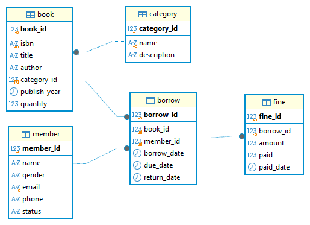

# ระบบห้องสมุด (Library System) — Term Project Template

เทมเพลตนี้ทำส่วนหน้าเว็บ (frontend) และ API ให้แล้ว
งานของนิสิตคือ **เขียน SQL** ใน `db.py` ให้ทำงานกับตารางใน `schema.sql`

## เริ่มต้น
1. `pip install -r requirements.txt`
2. แก้ `config.py` ใส่ user/password/host ของ MySQL ที่อาจารย์แจกให้
3. รัน `schema.sql` บน MySQL ของตัวเอง (สร้างตาราง category, book, member, borrow, fine + ข้อมูลตัวอย่าง)
4. `python app.py` → เปิด http://127.0.0.1:5000

> เปิดมาจะเห็นหน้าเว็บ แต่กดค้นหาจะขึ้น 🚧 TODO จนกว่าจะเขียน SQL ครบ

## งานที่ต้องทำใน db.py (มองหา # TODO)
ดูตัวอย่างที่เขียนให้แล้วก่อน: `search_members`, `get_member`

**CRUD** (แนะนำให้ทำตามลำดับนี้):
  1. หมวดหมู่: search_categories, get/create/update/delete_category
     (ต้องทำ `search_categories` ก่อน dropdown หมวดหมู่ในแท็บหนังสือจึงจะใช้ได้)
  2. สมาชิก: create/update/delete_member (ดูตัวอย่าง search_members — เพศใช้ = ไม่ใช้ LIKE เพราะอะไร?)
  3. หนังสือ: search_books (ต้องคำนวณคอลัมน์ `available`), get/create/update/delete_book
  4. การยืม/คืน: search_borrows, get_borrow, check_can_borrow, create/update/delete_borrow
     - ตาราง borrow ไม่มีคอลัมน์ status → คำนวณสถานะจากวันที่ด้วย CASE
     - ก่อนยืมต้องตรวจว่าสมาชิก active และหนังสือยังว่าง (`check_can_borrow`)
     - ฟอร์ม "แก้ไข" การยืมมีช่องค่าปรับ → get_borrow / update_borrow ต้องอ่าน/เขียนตาราง fine ด้วย

**รายงาน (JOIN + GROUP BY + subquery):**
  - report_summary — การ์ดสรุป (เขียน SQL แทนค่า None ทีละการ์ด + คิดการ์ดเพิ่มเอง 2 ใบ)
  - report_popular_books — 📈 หนังสือยอดนิยม (Most Borrowed)
  - report_overdue — ⏰ สมาชิกค้างคืน (Overdue)
  - report_members_above_avg — 🏅 สมาชิกที่ยืมมากกว่าค่าเฉลี่ย (Above Average)
  - รายงานเพิ่มเติมที่ออกแบบเอง (ดูหัวข้อถัดไป)

## วิธีเพิ่มรายงานใหม่ (แก้แค่ db.py)
1. เขียนฟังก์ชันใหม่ใน db.py เช่น
   ```python
   def report_unpaid_fines():
       """💰 ค่าปรับค้างชำระ"""
       sql = """
           SELECT m.name AS 'สมาชิก', SUM(f.amount) AS 'ค่าปรับรวม'
           FROM fine f
           INNER JOIN borrow br ON f.borrow_id = br.borrow_id
           INNER JOIN member m  ON br.member_id = m.member_id
           WHERE f.paid = FALSE
           GROUP BY m.member_id, m.name
       """
       return run_query(sql)
   ```
2. เพิ่ม 1 บรรทัดในรายการ `REPORTS` ท้าย db.py
   ```python
   ("unpaid-fines", "💰 ค่าปรับค้างชำระ", report_unpaid_fines),
   ```
3. รีเฟรชหน้า /report — กล่องรายงานใหม่จะขึ้นเอง
   (ชื่อคอลัมน์ที่ตั้งด้วย `AS` จะเป็นหัวตารางบนเว็บ)

**ไอเดียรายงานเพิ่มเติม:** สถิติการยืมแยกตามหมวดหมู่ (LEFT JOIN ให้หมวดที่ไม่มีคนยืมเป็น 0),
หนังสือคงเหลือพร้อมให้ยืม (quantity − จำนวนที่ยังไม่คืน), หนังสือที่ไม่เคยถูกยืม (NOT EXISTS)

## กติกา
- ใช้ `%s` เป็น placeholder เสมอ (กัน SQL injection)
- query ที่ join หลายตารางเขียนแบบ explicit INNER JOIN ... ON ...
- ชื่อตาราง/คอลัมน์ใน db.py ต้องตรงกับ schema.sql
- ช่องที่ไม่ได้กรอกในฟอร์มจะส่งมาเป็น `""` — คอลัมน์ที่ว่างได้ (เช่น DATE, email) ให้ใช้ `blank_to_none(...)`
- แจ้งข้อผิดพลาดให้ผู้ใช้เห็น: `raise ValueError("ข้อความ")` → หน้าเว็บแสดงเป็น alert


